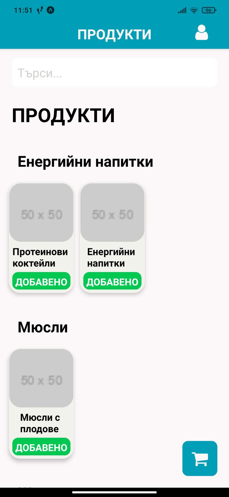
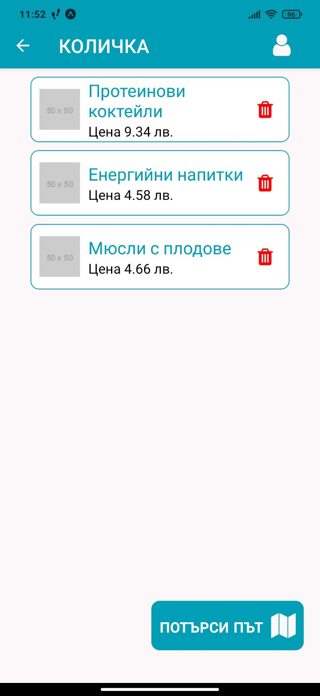
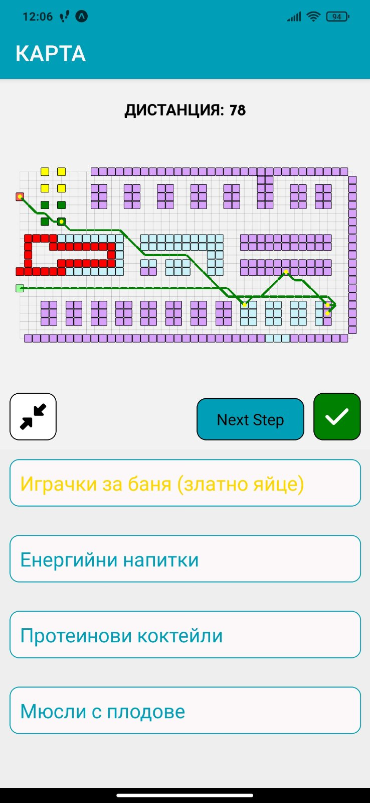

  
# Finder
## Нужни инсталации
1. PostgreSQL 16
2. Java 17
3. Maven
4. NodeJs

## Подкарване на PostgreSQL
За да може проекта да бъде стартиран трябва да има инициализирана база данни с името "hackathon".
```sh
sudo -u postgres psql
CREATE DATABASE hackathon;
```

## Подкарване на Spring
За стартиране на проекта трябва да бъдат зададени нужните параметри за връзка с базата данни. Те може да бъдат намерени в папката: "src/main/resources/application.yml".
```yaml
spring:
  datasource:
    url: jdbc:postgresql://localhost:5432/hackathon
    username: username
    password: password
    driver-class-name: org.postgresql.Driver
```

Стартиране на Spring частта от проекта:
```sh
mvn spring-boot:run -Dspring-boot.run.jvmArguments="-server -XX:+TieredCompilation -XX:TieredStopAtLevel=4 -XX:+UseParallelGC -Xms512m -Xmx1024m"
```

## Подкарване на React Native
За стартиране на проекта е нужно в Node да бъдат инициализирани всички зависимости.
```sh
npm install
```

За да се зададе какъв е пътя на endpoint-овете на трябва да се редактира файла: "client/.env".
```env
EXPO_PUBLIC_HOST=http://{ip}:{port}
```

Стартиране на React Native частта от проекта:
```
npm start
```

# Използване

След като си направи акаунт потребителят може да избира от списъка с продукти



След като си избере продуктите, които иска да закупи, отива при количката си



Накрая приложението показва къде се намират продуктите, които потребителят е добавил, както и едно специално 'Златно Яйце'. Освен това е начертан оптималният маршрут, който започва от входа на магазина, минава през всички избрани продукти и златното яйце, след това минава през точно една каса и завършва на изхода.


